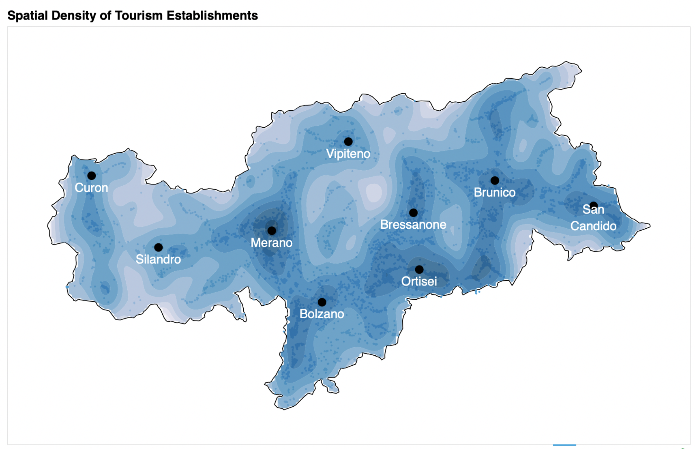

# About this repository
This repository contains several exploratory analyses in the style of Data Journalism.

# Examples

## Tourism

The folder `Tourism/SouthTyrol` investigates the tourism industry in the province of South Tyrol, Italy.
Tourism is one of the most important economic sectors of the province and in terms of per capita, the number of tourists 
in this region of Italy far exceeds those in the country overall and even that of the European Union [[1]](https://www.handelskammer.bz.it/sites/default/files/uploaded_files/Scuola_economia/economy_in_figures_2017_09_27_de.pdf).

Hence, the analysis focus on identifying which specific geographical regions within the province act as tourism hotspots.

More details are available in this [notebook](SouthTyrol/Tourism/notebooks/Tourism_in_South_Tyrol.ipynb)
and static examples of the interactive visualisations are showcased below:

