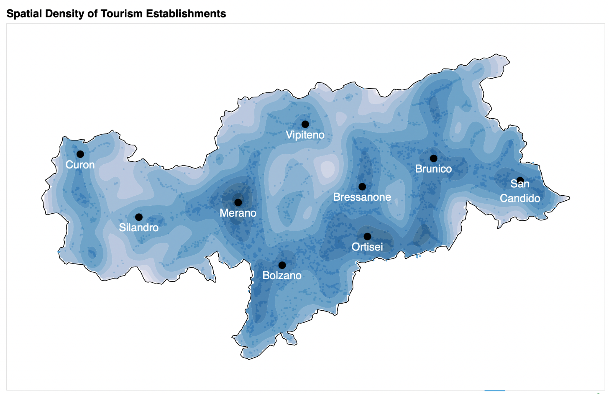

# Introduction

This project analyses the spatial distribution of tourism establishments in the province of South Tyrol, Italy, locally
known as Südtirol or Alto Adige.




# Visualisations

See this Streamlit app.

# Set-up

Requires [Poetry](https://python-poetry.org/) and Python 3.11.

## 1. Get the code and install dependencies

```commandline
git clone https://github.com/calyptis/DataJournalism.git
cd DataJournalism/SouthTyrol/Tourism
poetry install
```

## 2. Obtain the data

```commandline
poetry run prepare-dirs
poetry run download-data
poetry run parse-data
poetry run download-rooms
poetry run prepare-data
```

## 3. Prepare the dashboard data

```commandline
poetry run prepare-dashboard
```

## 4. Run the dashboard

```commandline
poetry run streamlit run south_tyrol_tourism/app.py
```

## 5. Run with Docker

```commandline
docker compose up
```

The dashboard is then available at http://localhost:8080. The `data/dashboard_data/` directory is
mounted as a volume, so updated pickle files are picked up without rebuilding the image.

# Datasources
- Shapefiles are obtained from the [Geocatalogue of South Tyrol](https://geonetwork1.civis.bz.it/geonetwork). 
  Specifically, the two files used in this project are:
    - `BEVÖLKERUNG UND WIRTSCHAFT` -> `Gesellschaft` -> `Ämtliche Bevölkerung`
    - `GRUNDLAGEN UND PLANUNG` -> `Grenzen` -> `Gemeinden`
    - An additional useful source is [https://www.catastobz.it/index_de.html](https://www.catastobz.it/index_de.html)
- Tourism data is obtained from the [Opendatahub API](https://tourism.opendatahub.bz.it/swagger/index.html#/Accommodation/SingleAccommodationRoom)

# TODO
- [ ] Streamlit pages need to cache

